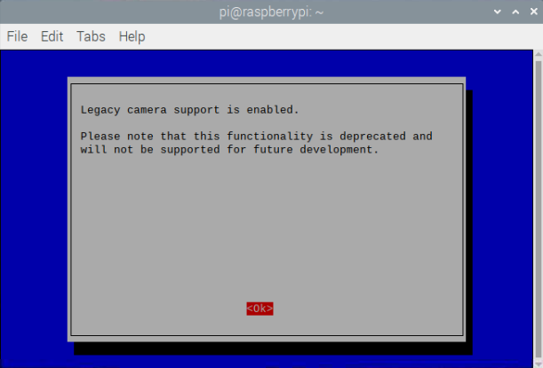

Das Python-Picamera-Modul ist derzeit standardmäßig nicht mit der neuesten Version von Raspberry Pi OS (genannt **Bullseye**) kompatibel.

Um das Picamera-Modul verwenden zu können, musst du die Legacy-Unterstützung für die Kamera aktivieren. <iframe width="560" height="315" src="https://www.youtube.com/embed/E7KPSc_Xr24" title="YouTube-Videoplayer" frameborder="0" allow="accelerometer; autoplay; clipboard-write; encrypted-media; gyroscope; picture-in-picture" allowfullscreen mark="crwd-mark"></iframe>

Öffne ein Terminalfenster und führe den folgenden Befehl aus:

```bash
sudo raspi-config
```

Scrolle mit den Cursortasten nach unten zu `Interface Options` und drücke die Eingabetaste.


Stelle sicher, dass „Legacy Camera Enable/disable Legacy Camera Support“ ausgewählt ist und drücke die Eingabetaste.


Wähle mit den Cursortasten `<Yes>` und drücke die Eingabetaste

Drücke zur Bestätigung erneut die Eingabetaste



Wähle `<Finish>` mit den Cursortasten


Drücke die Eingabetaste, um neu zu starten.


