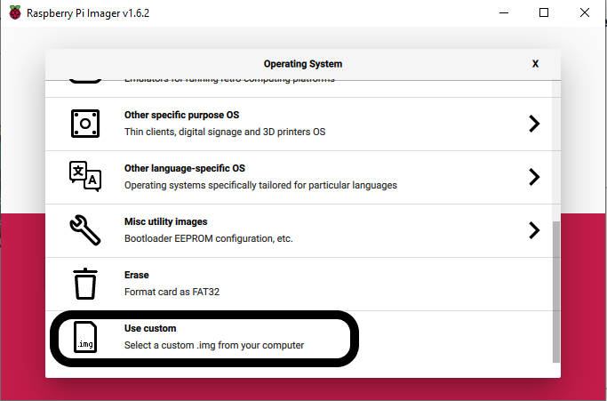

Due to changes in the latest version of Raspberry Pi OS (**Bullseye**), the Python Picamera module is no longer compatible with the updated operating system.

We are currently in the process of upgrading the Picamera module to work with the latest Raspberry Pi OS.

In the meantime, we suggest that you continue to use the last **Buster** version of the operating system, which can be downloaded [here](https://downloads.raspberrypi.org/raspios_armhf/images/raspios_armhf-2021-05-28/2021-05-07-raspios-buster-armhf.zip), if you are using the Python Picamera module.

You can download this image, and then use the [Raspberry Pi Imager](https://www.raspberrypi.com/software/) to write it to your microSD card.

When choosing the Operating System, select **Use custom**, and then select the image you have downloaded.

