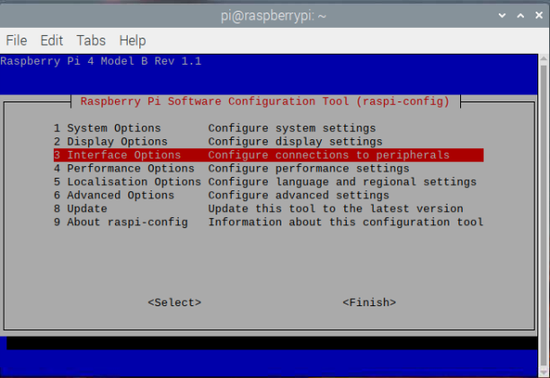

The Python Picamera module is currently not, by default, compatible with the latest version of Raspberry Pi OS (called **Bullseye**). 

To use the Picamera module, you will need to enable legacy support for the camera.

<iframe width="560" height="315" src="https://www.youtube.com/embed/E7KPSc_Xr24" title="YouTube video player" frameborder="0" allow="accelerometer; autoplay; clipboard-write; encrypted-media; gyroscope; picture-in-picture" allowfullscreen></iframe>

Open a terminal window and type the following command:

```bash
sudo raspi-config
```

Use the cursor keys to scroll down to `Interface Options` and press the 'Enter' key.



Make sure 'Legacy Camera Enable/disable legacy camera support' is selected and press the 'Enter' key.


Use the cursor keys to select `<Yes>` and press the 'Enter' key

Press 'Enter' again to confirm


Use the cursor keys to select `<Finish>`


Press 'Enter' to reboot.


