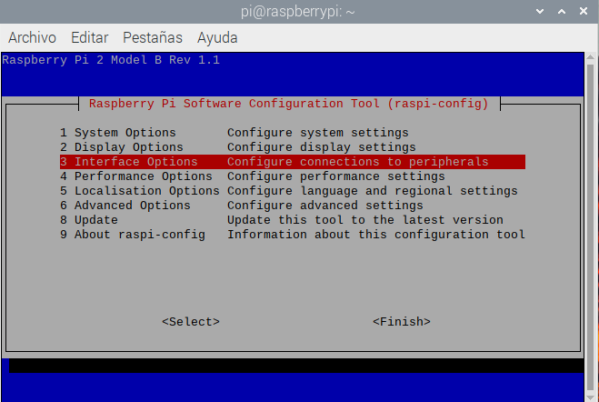
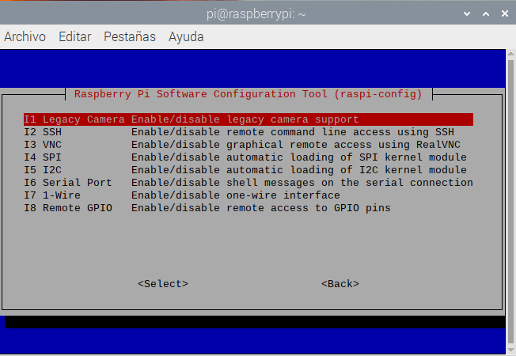
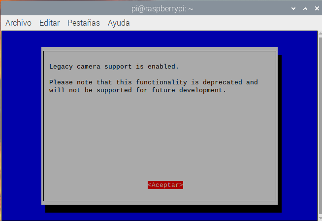
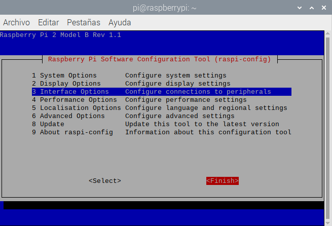
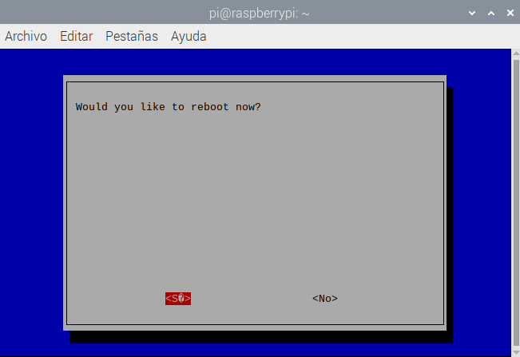

El módulo Picamera de Python actualmente no escompatible por defecto con la última versión del sistema operativo Raspberry Pi (llamada **Bullseye**).

Para usar el módulo Picamera, deberás habilitar el soporte para la cámara. <iframe width="560" height="315" src="https://www.youtube.com/embed/E7KPSc_Xr24" title="Reproductor de video de YouTube" frameborder="0" allow="accelerometer; autoplay; clipboard-write; encrypted-media; gyroscope; picture-in-picture" allowfullscreen mark="crwd-mark"></iframe>

Abre una ventana de terminal y escribe el siguiente comando:

```bash
sudo raspi-config
```

Usa las teclas del cursor para desplazarte hacia abajo hasta `Interface Options` y presiona la tecla 'Intro'.



Asegúrate de que 'Legacy Camera Enable/disable legacy camera support' esté seleccionado y presiona la tecla 'Intro'.



Usa las teclas del cursor para seleccionar `<Yes>` y presiona la tecla 'Intro'

Presione 'Intro' nuevamente para confirmar



Usa las teclas del cursor para seleccionar `<Finish>`



Presiona 'Intro' para reiniciar.



