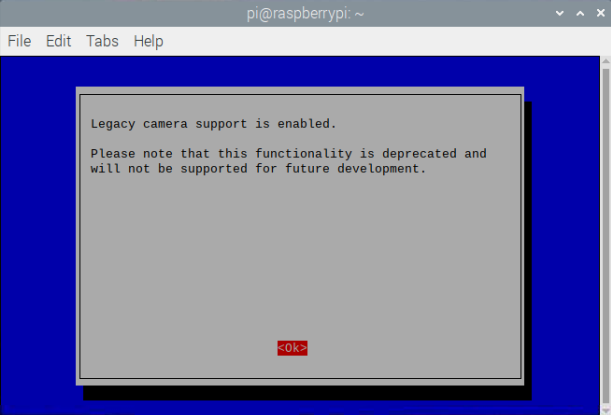
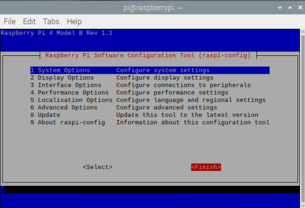

Python Picamera 모듈은 현재 기본적으로 최신 버전의 Raspberry Pi OS (**Bullseye**이라고 함)와 호환되지 않습니다.

Picamera 모듈을 사용하려면 카메라에 대한 레거시 지원을 활성화 하셔야 합니다. <iframe width="560" height="315" src="https://www.youtube.com/embed/E7KPSc_Xr24" title="YouTube 비디오 플레이어" frameborder="0" allow="accelerometer; autoplay; clipboard-write; encrypted-media; gyroscope; picture-in-picture" allowfullscreen mark="crwd-mark"></iframe>

터미널 창을 열고 다음 명령어를 입력하세요:

```bash
sudo raspi-config
```

커서 키를 사용하여 `Interface Options(인터페이스 옵션)` 까지 아래로 스크롤하고 'Enter' 키를 눌러주세요.


'레거시 카메라 활성화/비활성화 레거시 카메라 지원' 이 선택되어 있는지 확인하고 'Enter' 키를 눌러주세요.


커서 키를 사용하여 `<Yes>` 를 선택하고 'Enter' 키를 눌러주세요.

다시 'Enter'를 눌러 확인해 주세요.



커서 키를 사용하여 `<Finish>`를 선택하세요.



'Enter'를 눌러 재부팅 하세요.


