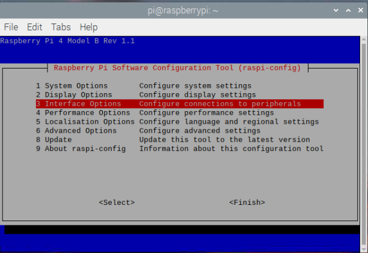
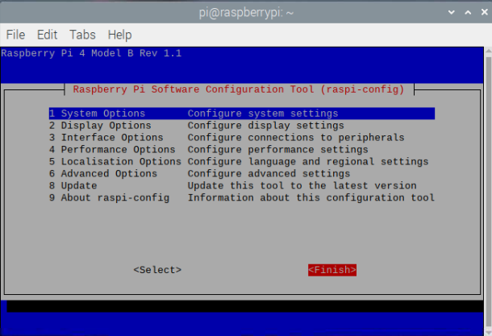
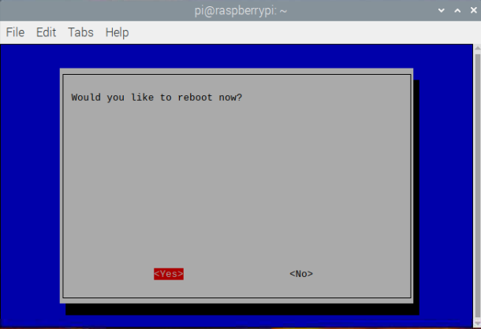

默认情况下，Python里的Picamera 模块目前是不兼容最新版本的 Raspberry Pi 操作系统（称为 **Bullseye**）。

要使用 Picamera 模块，您将需要启用对摄像头的旧版支持。 
<iframe width="560" height="315" src="https://www.youtube.com/embed/E7KPSc_Xr24" title="YouTube 视频播放器" frameborder="0" allow="accelerometer; autoplay; clipboard-write; encrypted-media; gyroscope; picture-in-picture" allowfullscreen mark="crwd-mark"></iframe>

打开一个终端窗口，然后输入以下命令：

```bash
sudo raspi-config
```

使用光标键向下滚动到 `Interface Options` ，然后按“Enter”键。



确定选中“Legacy Camera  Enable/disable legacy camera support”，然后按“Enter”键。


使用光标键选择 `<Yes>`，并按“Enter”键

再次按“Enter”确认


使用光标键选择 `<Finish>`



按“Enter”重新启动。



